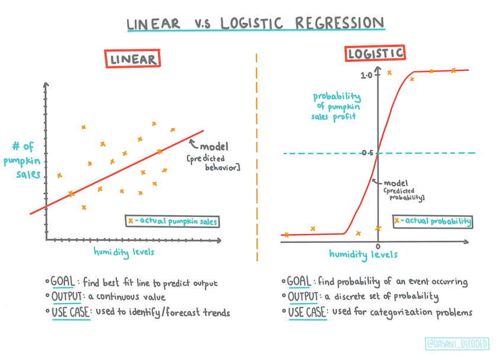
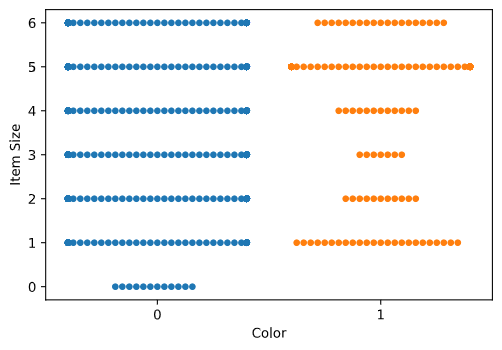
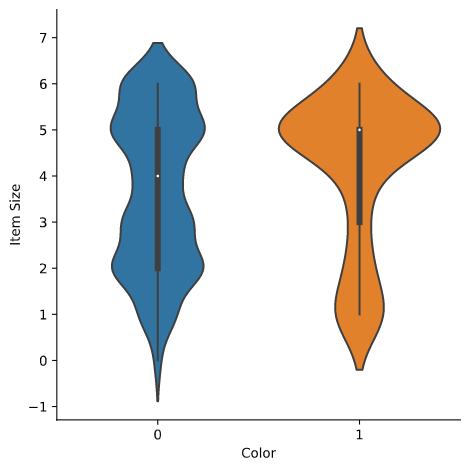

# Analysis US pumpkin Using Logistic Regression

## Prerequisite

_Having worked with the pumpkin data, we are now familiar enough with it to realize that there's one binary category that we can work with: Color._

Let's build a logistic regression model to predict that, given some variables, what color a given pumpkin is likely to be (orange 🎃 or white 👻).

First We tidy up our Pumpkin Data

Visualization - side-by-side grid using seaborn

Use a swarm plot

Use violin plot

Build model

Building a model to find these binary classification is surprisingly straightforward in Scikit-learn.

using Sklearn models
